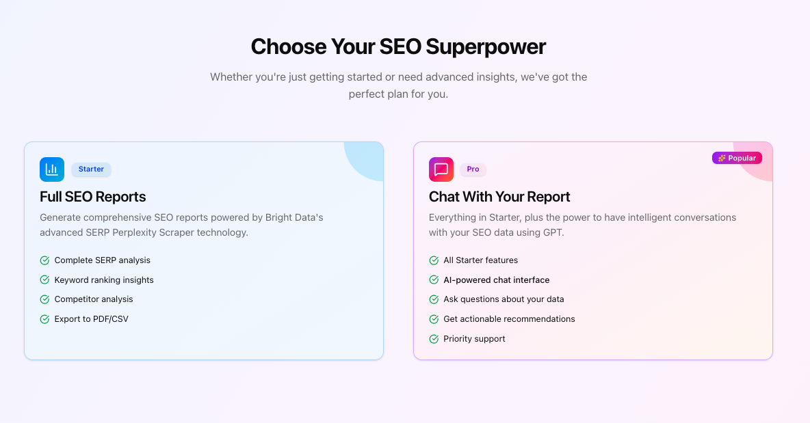
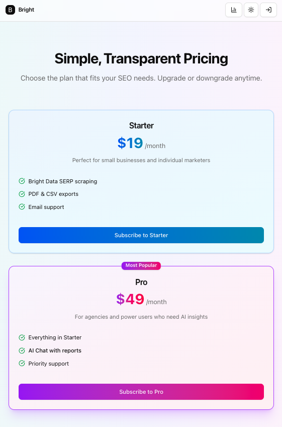
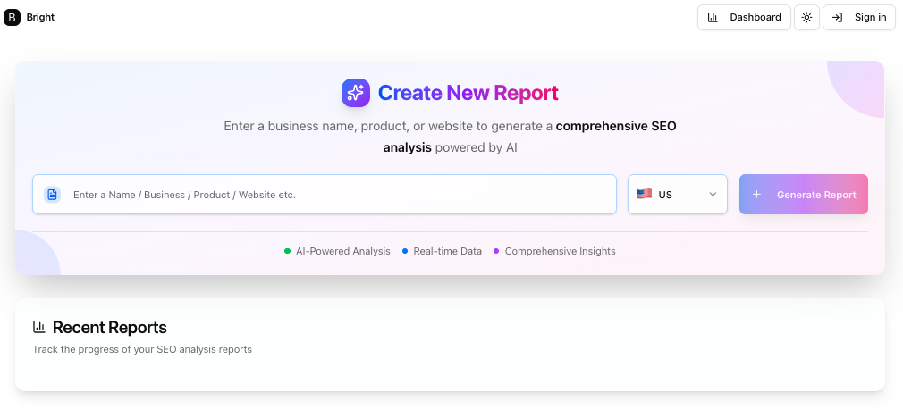
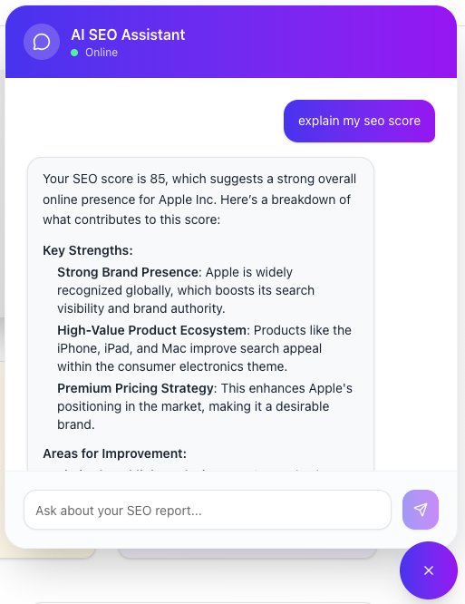
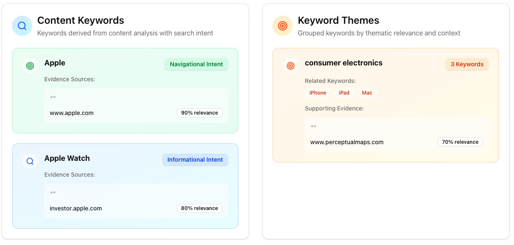
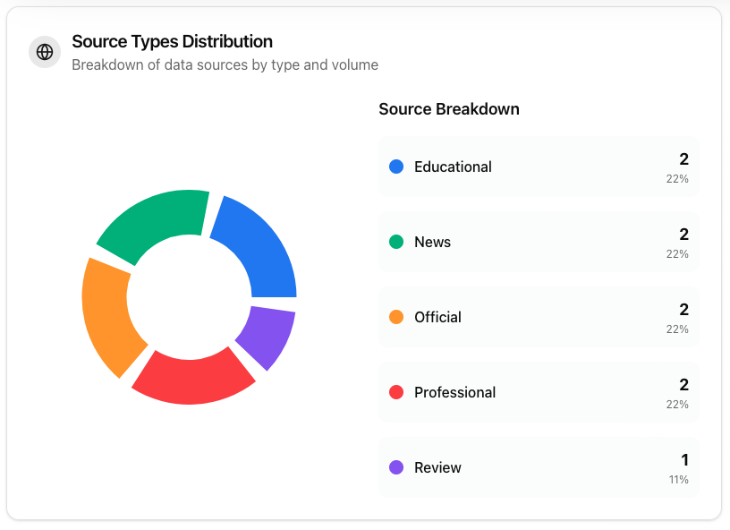
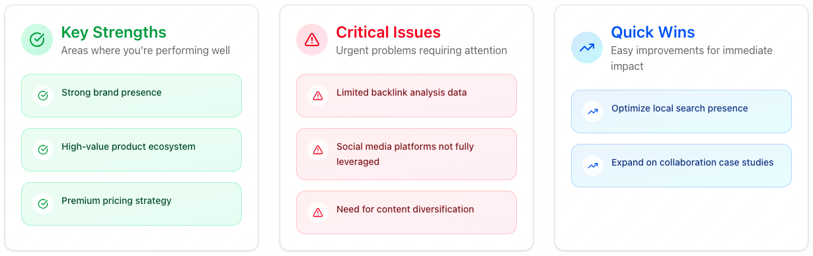
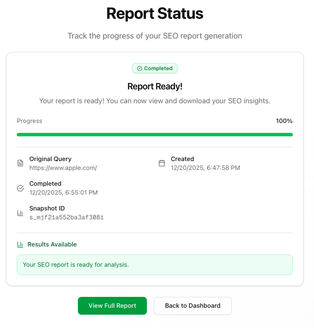

# 🚀 Insight AI SEO Marketing SaaS

[](https://nextjs.org/)
[](https://react.dev/)
[](https://www.typescriptlang.org/)
[](https://convex.dev/)
[](https://clerk.com/)
[](https://stripe.com/)
[](https://openai.com/)
[](https://brightdata.com/)
[](https://tailwindcss.com/)
[](https://ui.shadcn.com/)

**Generate beautiful, data-driven SEO reports in seconds using AI, real-time scraping, and modern full-stack architecture.**

This project demonstrates how to build a **production-ready SEO marketing SaaS** using **Next.js 16**, **Convex**, **Clerk billing**, **Bright Data scraping**, and **AI-powered analysis with OpenAI**.

---

## 🧠 What This App Does

Think of this as an **AI-powered SEO analyst**.

You enter a company, product, or website → the system:
1. Scrapes real SERP data using Bright Data
2. Processes results with AI using structured prompts
3. Generates a validated SEO report
4. Streams progress in real time
5. Lets Pro users **chat with the report** for deeper insights

---

## ✨ Core Features

- 🔐 **Authentication & Billing** — Clerk auth with Starter / Pro plans (Stripe-powered)
- 📊 **AI SEO Report Generation** — Structured, evidence-backed SEO analysis
- 🌐 **Professional Web Scraping** — Bright Data SERP & Perplexity integration
- ⚡ **Real-Time Progress Tracking** — Live job status updates via Convex
- 🤖 **AI SEO Assistant (Pro)** — Chat with reports using contextual AI + web search
- 📈 **Beautiful Dashboards** — Charts and insights with Recharts
- 🔁 **Smart Retry Logic** — Retry failed analyses without re-scraping expensive data

---

## 🖼️ Screenshots

| Homepage | Features |
|--------|----------|
|  |  |

| Pricing | Create New Report |
|--------|------------------|
|  |  |

| AI Analysis | AI Assistant |
|------------|-------------|
|  |  |

| Keywords & Themes | Report Categories |
|------------------|------------------|
|  |  |

| Source Statistics | Report Status |
|------------------|---------------|
|  |  |

---

## 🧩 Project Structure

```txt
app/
  page.tsx                 # Marketing homepage
  dashboard/
    page.tsx               # Report creation & management
    report/[id]/page.tsx   # Report status & loading
    summary/page.tsx       # Full SEO analysis
    ui/                    # Report visualization components
  api/chat/route.ts        # AI chat endpoint
components/
  AIChat.tsx               # Pro chat interface
  ReportsTable.tsx         # Dashboard listing
  ConvexProviderWithClerk.tsx
convex/
  schema.ts                # Database schema
  scrapingJobs.ts          # Job orchestration
  analysis.ts              # AI workflows
  http.ts                  # Bright Data webhooks
actions/
  startScraping.ts         # Start scraping jobs
  retryAnalysis.ts         # Smart retry logic
lib/
  seo-schema.ts            # Zod schemas
  seo-utils.ts             # SEO helpers
middleware.ts              # Clerk route protection
```

---

## 🔄 How It Works

### Data Flow
1. User submits entity + country
2. `startScraping` creates a Convex job
3. Bright Data scrapes SERP data
4. Webhook delivers raw data to Convex
5. OpenAI processes structured prompts
6. SEO report is validated & stored
7. Pro users chat with the report

### Background Processing
- Long-running jobs via **Convex schedulers**
- Real-time updates via reactive queries
- Retry without re-scraping raw data

---

## 🧠 AI Architecture

- **Structured Outputs** using Zod schemas
- **Evidence-based insights** (quotes + URLs)
- **Context-aware AI chat**
- **Web search augmentation** (Pro feature)
- **Vercel AI SDK** for streaming & type safety

---

## 🚀 Getting Started

### Prerequisites
- Node.js 18+
- pnpm
- Accounts:
  - Clerk
  - Convex
  - Bright Data
  - OpenAI
  - Vercel

### Step-by-Step Setup

```bash
git clone https://github.com/johnsonr84/ai-seo-marketing-saas
cd ai-seo-marketing-saas
pnpm install
cp .env.example .env.local
```

Fill in `.env.local`:

```env
# Clerk
NEXT_PUBLIC_CLERK_PUBLISHABLE_KEY=
CLERK_SECRET_KEY=

# Convex
CONVEX_DEPLOYMENT=
NEXT_PUBLIC_CONVEX_URL=

# Bright Data
BRIGHTDATA_API_KEY=

# OpenAI
OPENAI_API_KEY=

# Vercel AI Gateway
AI_GATEWAY_API_KEY=
```

Start development:

```bash
pnpm dev
npx convex dev
```

---

## 🧯 Common Issues

- ❌ Missing env vars → double-check `.env.local`
- 🔑 Clerk JWT → ensure `convex` JWT template exists
- 🌐 Webhooks → verify Bright Data can reach `/api/webhook`
- 🤖 Rate limits → monitor OpenAI usage
- 🔁 Convex schema → run `npx convex dev`

---

## 👨‍💻 Author

**Robert Johnson**  
Full-Stack Software Engineer  
🌐 https://robertjohnsonportfolio.com

---
